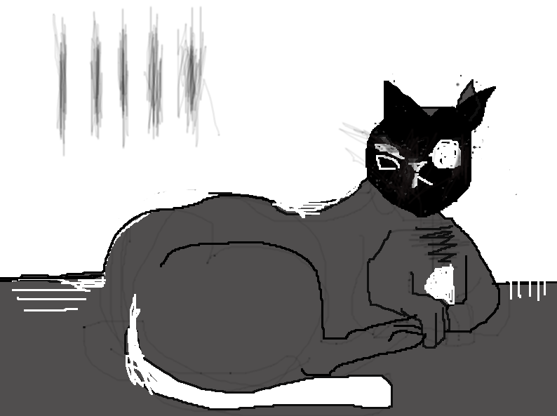

## April 04, 2024

A peculiar shift occurred in Edgar's behavior today, a subtle deviation from his usual antics that left me pondering. His movements carried an air of mystery, an unspoken language that lingered in the shadows. Though indescribable, there was a disquieting charm to this newfound enigma, a secret dance between feline whimsy and uncharted territories.

In the wake of this mysterious episode, I found myself traversing the landscapes of dreams, where reality melded with the surreal. Whispers of unknown realms echoed in the corridors of my subconscious, painting ethereal portraits that danced on the edge of understanding. As I prepare to unveil these strange dreams, I sense a connection between the nocturnal phantoms and the unspoken secrets Edgar now guards.

Details of these surreal dreams shall follow, their enigmatic threads weaving into the tapestry of our peculiar companionship.

* Mysterious Edgar: 

    
