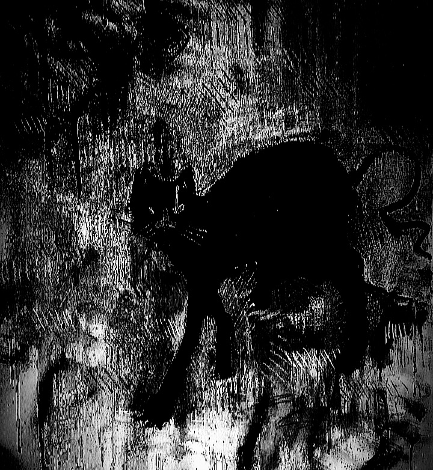

## December 31, 2024

In the wake of this unending night, the last of the year, solitude has become my unwavering companion. The reasons behind this self-imposed exile remain obscured, cloaked in the shadows of guilt that shroud my consciousness. The peculiar apartment, once vibrant with the enigmatic presence of Edgar, now echoes with the haunting emptiness of abandonment.

The weight of culpability bears down upon me, manifesting in relentless apparitions that intertwine reality and delusion. Edgar's countenance materializes in every feline silhouette that graces the streets, in the nocturnal apparitions that dance through the corridors of my fractured dreams. The line between sanity and delirium blurs, and in the throes of psychological tumult, a mantra emerges – "Edgar is immortal."

* A spectral image haunting the narrator's dreams:

The relentless repetition of this eerie incantation echoes through the recesses of my tormented mind. The walls of reason crumble, and the ghostly specter of Edgar, both a manifestation of past transgressions and an emblem of unsparing guilt, becomes an ever-present companion in my descent into the abyss of existential disarray.

As the curtain falls on this macabre tale, the peculiar apartment stands as a testament to the enigmatic intertwining of lives and the inexorable descent into the realms where reality and phantasmagoria converge. The whispered echoes of "Edgar is immortal" persist, a haunting refrain that lingers in the shadows of my fractured psyche, an indelible mark etched upon the tapestry of my irreversible unraveling.

