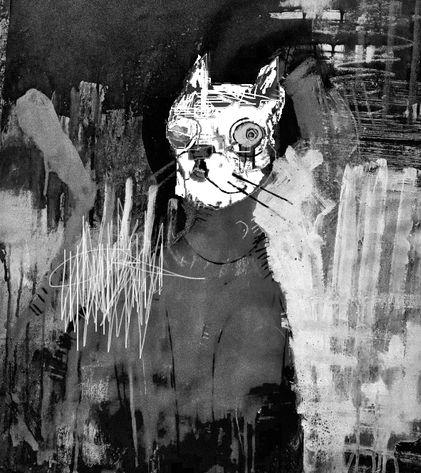
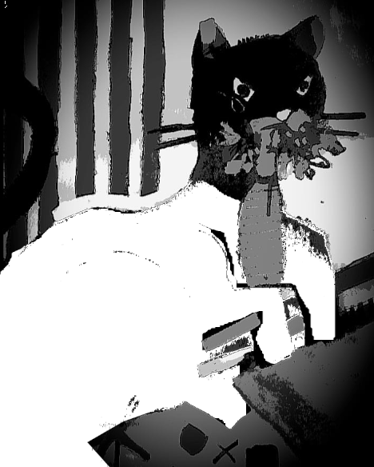
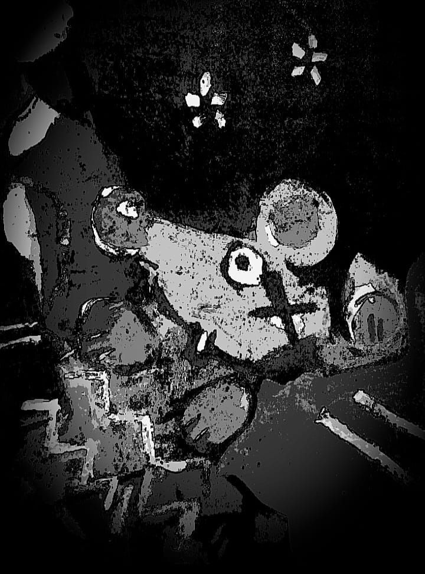

## February 01, 2024

In the early days, Edgar was a ghostly presence, a shadow concealed within a cardboard box from our move to the new apartment. His eyes gleamed with a mix of fear and curiosity, embodying the uncertainty of his past.

* Drawing of Edgar in the cardboard box:

  

Despite my attempts to coax him out with gentle words and gestures, Edgar remained elusive, his haunting gaze following my every move like an unsolved riddle.

* Drawing depicting the haunting gaze:

  

With time, a transformation unfolded. Edgar, once a timid spirit, began leaving subtle tokens throughout the house — feathers, playful paw prints — a deliberate dance to draw my attention.

* Drawing capturing the subtle tokens:

  

The apartment gradually metamorphosed into a playground, resonating with Edgar's newfound confidence and mischievous antics. The walls echoed with the laughter of this peculiar home.

As I reflect on these changes, I can't help but marvel at the bond that has formed. Edgar and I, two solitary beings, navigate the realms of companionship in this small, peculiar world. In his playful leaps and quiet moments when our eyes meet, I sense something profound an understanding that transcends words.

