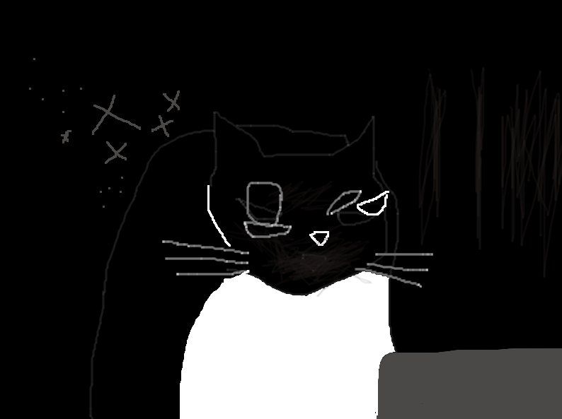

## February 23, 2024

Edgar's mischievous exploits took an unexpected turn today. In a comical yet bewildering twist, I found him perched on the edge of the toilet bowl, paws dangling into the water. Whether an accidental slip or a curious exploration, I couldn't fathom. Chuckling at the absurdity of the moment, I rescued him from his watery escapade.

After a surprisingly cooperative struggle, Edgar found himself in the midst of an impromptu bath. Bubbles and fur twirled in a peculiar dance, an unintentional performance in the bathroom-turned-stage. His disgruntled meows echoed against the ceramic walls, protesting the unexpected plunge.

Yet, amid the chaos, there was an odd camaraderie. The shared laughter, the clumsy attempt at drying off, and the exchanged glances spoke of a connection beyond the ordinary. As I navigated the waters of this unforeseen event, I realized that these unscripted moments are the threads weaving the tapestry of our peculiar companionship.

* Photo of Edgar post-bath, a soggy yet resilient explorer:

  
