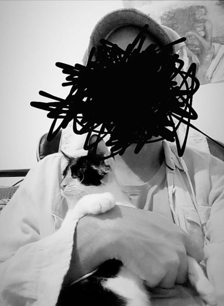
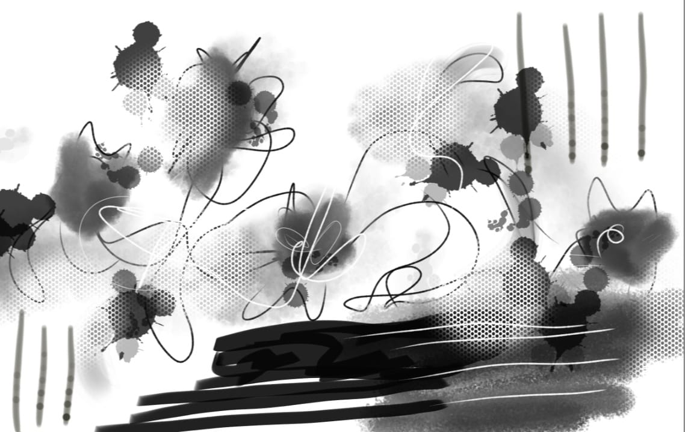

## January 15, 2024

Today, I found an abandoned cat on the street and decided to bring it home. I named him Edgar in homage to *Edgar Allan Poe*. He has eyes that reflect a deep mystery.

* Me and Edgar:

  

Edgar is curious and playful, but I feel something inexplicable about him, as if there's more than just an ordinary cat. I am looking forward to uncovering more about what this new chapter in my life holds.

* Drawing of Edgar exploring the house:

  
