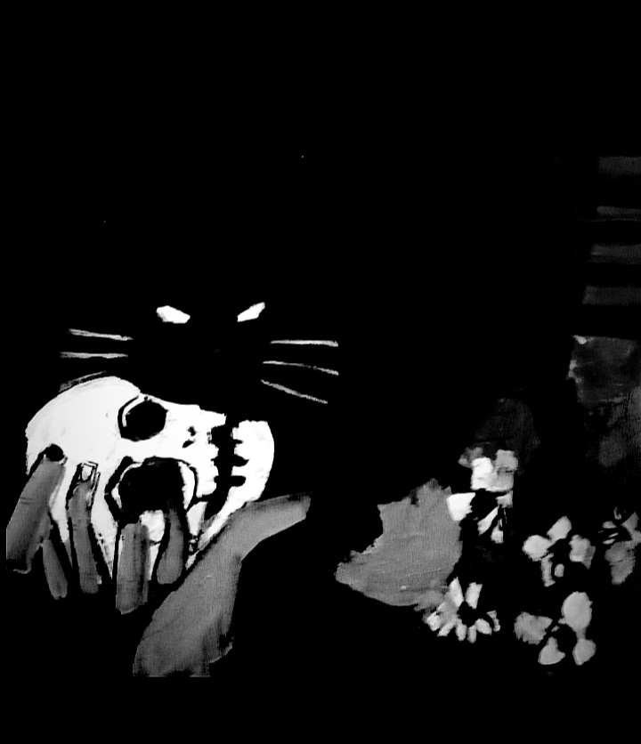

## July 18, 2024

In an unintentional turn of events today, I found myself unwittingly entangled in a hallucinogenic escapade that blurred the lines between reality and reverie. A quest for a moment of respite led me to a mishap where, in a peculiar twist of fate, catnip (really) found its way into the mix as I rolled a joint, opening a portal to a surreal realm of waking dreams.

At the height of my hallucination, I found myself seated on the couch, sharing an otherworldly smoke with Edgar. The haze of catnip and cannabis smoke twirled around us, creating a surreal setting where the line between the imaginary and the tangible blurred.

In a shadowy moment, Edgar, with penetrating eyes fixed on mine, proclaimed with an unsettling serenity: "I am immortal." The echo of this statement reverberated within the walls of my consciousness, creating a shiver that transcended the boundaries of hallucination.

From that point on, the boundaries of time and logic became hazy, and the line separating the real from the imaginary became almost imperceptible. The sound of feline laughter, the ethereal contours of the room. Everything seemed to compose a surreal spectacle.

* Bad trip w/ Edgar:

The transition back to reality was abrupt and marked by a startled awakening. Edgar, the harbinger of my hallucinations, now rested on the windowsill, a portrait of feline tranquility. The shock between the surreal and the mundane left me intrigued, an unsettling sensation that lingered in the quietness of the peculiar apartment.

