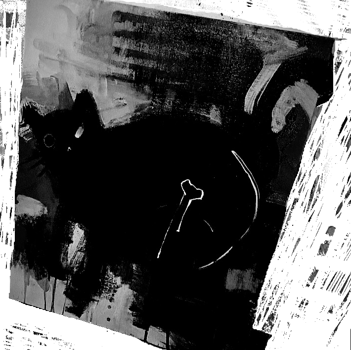
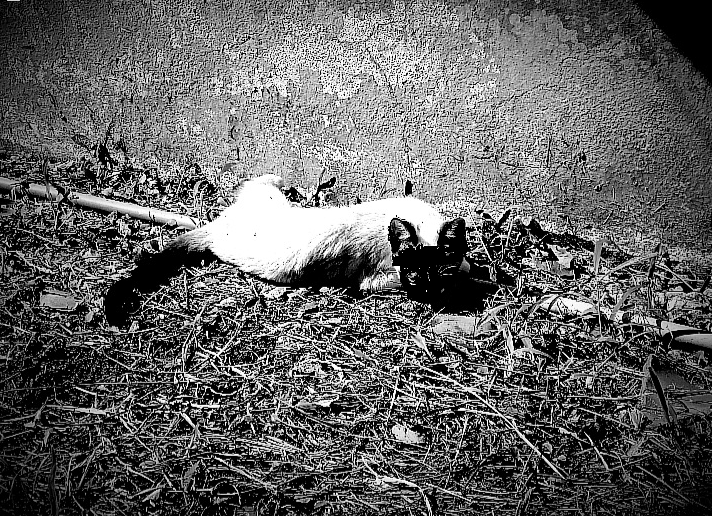

## July 22, 2024

A disconcerting episode unfolded today, shrouding our peculiar abode in an unsettling aura. As I immersed myself in the solace of a shower, the tranquility was ruptured by an unexpected spectacle. Edgar, in a capricious display of feline acrobatics, clung to the toilet, leaped onto the shower stall, and, with an audacious maneuver, landed atop the showerhead. His playful antics took a sinister turn when his inquisitive paws brushed against a frayed wire, delivering an electrifying shock.

In the throes of the electric surge, a peculiar vision unfolded before my eyes. The silhouette of Edgar, momentarily transformed into a radiant skeleton akin to an X-ray, flickered amidst the charged air. The surreal luminosity cast an eerie glow, blurring the boundaries between the corporeal and the spectral.

* Edgar's skeleton: 

Refusing to accept the possibility of Edgar's demise, I cradled his seemingly lifeless form in a cocoon of blankets on the floor, maintaining an unwavering vigil until the tendrils of exhaustion pulled me into the realm of sleep.

The following morning, reality distorted itself in a disconcerting revelation. As the first light of dawn bathed the room, a sudden jolt roused me from my slumber. To my astonishment, Edgar, his luminous skeleton now a mere memory, stood before me, vitality restored. The dissonance between the events of the night and the living, breathing presence of the feline companion left me in a state of bewildered fascination.

* Edgar's resurrection: 

The enigma of that night lingered, an indelible mark in the tapestry of our shared existence, weaving threads of the inexplicable into the fabric of our relationship.

