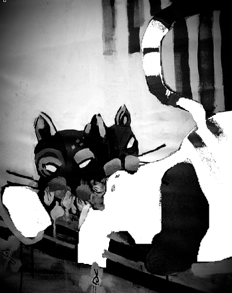

## June 07, 2024

A disquieting turn unfolded today as I attempted to engage Edgar in a playful moment, only to find myself ensnared in an unexpected tempest. The air crackled with an unspoken tension as playful leaps escalated into a chaotic ballet of claws and fur. In the aftermath, I emerged battered and bewildered, my face, arms, chest, and neck bearing the silent testimony of a feline tempest.

The wounds, both physical and metaphorical, run deeper than the scratches etched on my skin. Edgar, once a whimsical companion, has become an enigma, his playful demeanor overshadowed by an unexplained ferocity. The laughter that once echoed through our peculiar home has been replaced by a solemn silence, a haunting reminder of the uncharted territories within the feline psyche.

As I sit with my wounds, physical and emotional, I find myself grappling with the uncertainty that shrouds this unanticipated chapter in our shared narrative. The playful innocence of our earlier days now stands juxtaposed against the reality of jagged claws and wounded trust.

In sharing this bewildering encounter, I invite you, dear reader, to traverse the nuances of this mysterious bond. Perhaps you, too, have felt the sting of an unexpected tempest in the guise of companionship. The journey of understanding, it seems, is fraught with shadows and unforeseen complexities.

* Enigmatic Edgar: 

    
