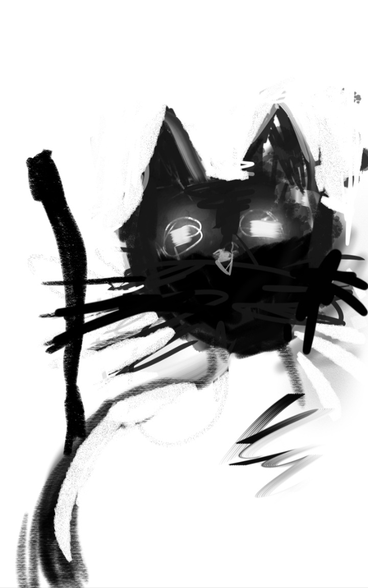

## March 05, 2024

Today, as the afternoon sunlight cast a warm glow through the windows, I found myself captivated by the rich history of feline artistry. The enigmatic allure of cats, timeless subjects of countless masterpieces, echoed in the halls of my peculiar abode.

In my journey through the annals of art, I stumbled upon the works of celebrated painters who immortalized the feline form. From Edouard Manet's beguiling Olympia to Balthus' enigmatic The King of Cats, each stroke of the brush seemed to whisper secrets of feline mystery.

As I delved deeper into this artistic exploration, I uncovered tales of cats serving as muses, inspiring creativity in the likes of Leonardo da Vinci and his sketches of cats intertwined with the fabric of history. The mischievous grins of Cheshire Cats and the sphinx-like poses in ancient Egyptian hieroglyphs hinted at a shared language only those attuned to feline enigma could decipher.

Within the quietude of my apartment, I sensed a connection to these artistic echoes, as if Edgar, too, harbored the wisdom of countless feline portraits. He sauntered into the room, an unwitting model for this peculiar chapter in our shared artistic exploration.

* Drawing of Edgar posing, a living canvas of feline grace:

  
