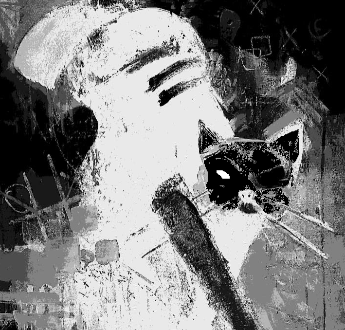

## May 31, 2024

Today marked an unexpected chapter in our peculiar companionship, a skirmish, if you will, between Edgar and me. The details are a blur of hissing whispers and the swish of a tail, a fleeting disagreement that left a lingering tension in the air. In the aftermath, Edgar, perturbed, slipped through the door, vanishing into the shadows.

His absence, though brief, felt like an eternity. When he returned, it was not with the usual nonchalant swagger but with an air of mystery that clung to his fur like an invisible veil. His eyes, once familiar orbs of feline curiosity, now harbored an enigmatic gleam, a silent witness to the unspoken realms he might have traversed during his brief escape.

I tried to decipher the cryptic tale etched in his fur, but Edgar, ever the *elusive maestro*, kept his secrets close. His movements, once a ballet of playful elegance, now carried an unspoken weight, a silent echo of the shadows he might have danced through in my absence.

As I extended an olive branch, hoping to bridge the unspoken gap, Edgar responded with a mixture of caution and curiosity. Our shared space, once a haven of understanding, now harbored a quiet tension, a palpable reminder of the transient nature of our peculiar bond.

* Edgar's return:

    
