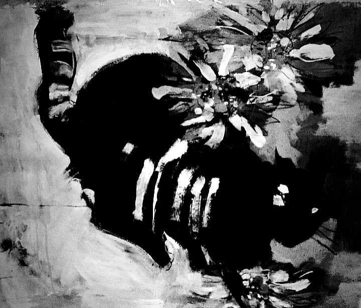
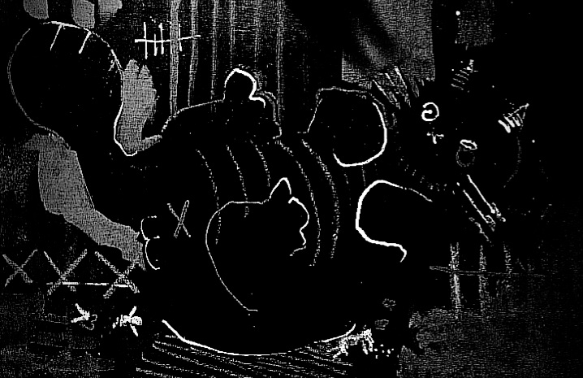

## October 25, 2024

A staggering shock seized my soul, unveiling a narrative that transcends the boundaries of the supernatural. The veil of normalcy surrounding Edgar unraveled in an unsettling spectacle. I suddenly realized he had gained an unusual weight. An enigmatic mystery unfolded when, on an ordinary day, the truth revealed itself before my astonished eyes. Edgar, in fact, was pregnant.

* Edgar's unexpected pregnancy:

The gestation period reached its conclusion in an atmosphere tinged with inexplicable tension. An aura of disquiet clung to the peculiar apartment as the inevitable moment approached. Uneasy whispers echoed in the shadows, foretelling a climax that defied the laws of nature.

Amidst the eerie anticipation, life took a grim turn. A romantic evening shattered as a foreboding call from the building superintendent cut through the air. Disturbing noises emanated from my apartment, prompting an abrupt end to the dinner, and a swift return home.

Upon arrival, a grotesque tableau awaited me. Edgar, hunched and obscured, revealed himself as I drew near. When the feline visage turned to meet my gaze, a ghastly tableau unfolded Edgar's whiskers drenched in the crimson hue of filial demise. He feasted upon his own offspring, an unspeakable act that defied the boundaries of feline nature.

* Edgar's filial demise: 

